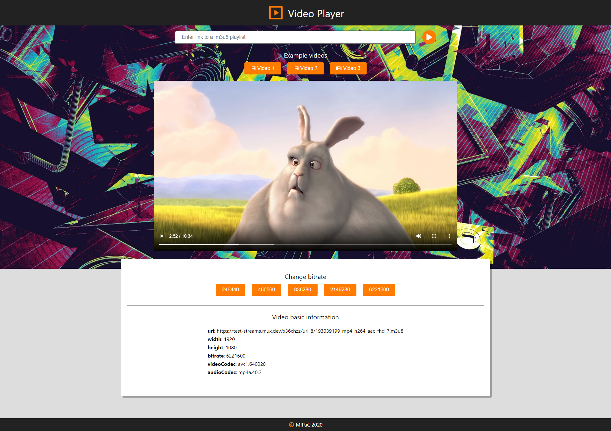

# HLS Video Player

The project is a simple Web Player that allows for playback of HTTP Live Streaming. The project has been created to the needs of the University "Multimedia Information Processing and Communications" course. The application allows you to play some example videos or any .m3u8 playlist by entering a link. There is also the possibility to change the video bitrate and view its parameters. The application has been created using [React.js](https://reactjs.org/) and  [hls.js](https://github.com/video-dev/hls.js/).

